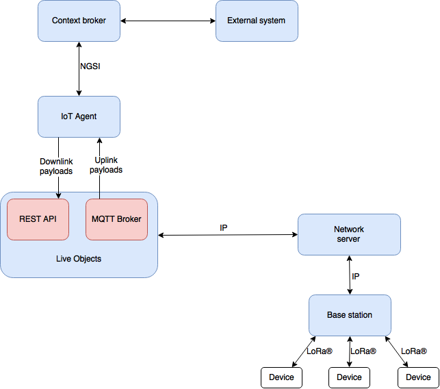

[](https://travis-ci.org/Orange-OpenSource/fiware-openlpwa-iotagent)
[](LICENSE)

# Fiware LoRa®\* IoT Agent

This project is a bridge between the Orange LoRa®\* network and the OMA NGSI protocol used by the Orion Context Broker as well as by other components of the FIWARE ecosystem.

## <a name="overview"/>Overview

This IoT agent is a library that can be used for example in a SpringBoot application.

This agent allows to :
* retrieve uplink payloads from LoRa®\* devices to update a NGSI Context Broker.
* send downlink payloads to LoRa®\* devices from a NGSI Context Broker.

This library uses Live Objects®\** platform ([https://liveobjects.orange-business.com/#/liveobjects](https://liveobjects.orange-business.com/#/liveobjects)) to manage LoRa®\* payloads.

NGSI v1 implementation is provided by the [Orange-OpenSource/fiware-ngsi-api](https://github.com/Orange-OpenSource/fiware-ngsi-api) library.

## <a name="architecture"/>Architecture

Here's the global architecture of the IoT agent using Live Objects®\** platform to manage LoRa®\* device payloads:



## <a name="installation"/>Installation

### <a name="requirements"/>Requirements

* JAVA 8
* Maven (for build)
* MongoDB instance
* A Live Objects®\** account

### <a name="maven"/>From Maven

```xml
<dependency>
    <groupId>com.orange.fiware</groupId>
    <artifactId>openlpwa-iotagent</artifactId>
    <version>X.Y.Z</version>
</dependency>
```

where `X.Y.Z` is the version of the library to use (check git tags).

### <a name="configuration"/>Configuration

You can modify some application settings either adding :
* a `src/main/resources/application.properties` in your application.
* command line parameters when you launch the application.

This is a list of the application properties:

<table>
    <tr><th>Name</th><th>Description</th><th>Default Value</th></tr>
    <tr><td>contextBroker.localUrl</td><td>public URL to this instance</td><td>http://localhost:8081</td></tr>
    <tr><td>contextBroker.remoteUrl</td><td>URL to the remote broker (Orion)</td><td>http://localhost:8082</td></tr>
    <tr><td>contextBroker.remoteFiwareService</td><td>remote broker Service Name</td><td></td></tr>
    <tr><td>contextBroker.remoteFiwareServicePath</td><td>remote broker Service Path</td><td></td></tr>
    <tr><td>contextBroker.remoteAuthToken</td><td>OAuth token for secured remote broker</td><td></td></tr>
    <tr><td>mongodb.host</td><td>MongoDB instance host</td><td>localhost</td></tr>
    <tr><td>mongodb.port</td><td>MongoDB instance port</td><td>27017</td></tr>
    <tr><td>mongodb.databasename</td><td>MongoDB database name</td><td> fiware-iotagent</td></tr>
    <tr><td>mongodb.username</td><td>MongoDB user name</td><td></td></tr>
    <tr><td>mongodb.password</td><td>MongoDB password</td><td></td></tr>
    <tr><td>openLpwaProvider.restUrl</td><td>Live Objects®** API URL</td><td>https://lpwa.liveobjects.orange-business.com</td></tr>
    <tr><td>openLpwaProvider.apiKey</td><td>Live Objects®** API key</td><td></td></tr>
    <tr><td>openLpwaProvider.mqttUri</td><td>Live Objects®** MQTT broker URI</td><td>tcp://liveobjects.orange-business.com:1883</td></tr>
    <tr><td>openLpwaProvider.mqttClientId</td><td>Live Objects®** MQTT broker client identifier</td><td>fiware-iotagent-client</td></tr>
</table>

## <a name="usage"/>Usage

In order to use a LoRa®\* device with the agent, please follow this steps:
* Register the device on the Live Objects®\** platform.
* Decode and encode the device payloads.
* Start the agent.
* Register the device in the agent.
* Send a command to a device.

### <a name="registerOpenLpwaProvider"/>Register the device on the Live Objects®\** platform

Before starting to use the agent, you must register the device on the LPWA Live Objects®\** portal ([https://lpwa.liveobjects.orange-business.com](https://lpwa.liveobjects.orange-business.com)).
If your device is correctly registered and active, you should see upcoming payloads on the website.

### <a name="decodeEncode"/>Decode and encode the device payloads

Live Objects®\** platform manages LoRa®\* hexadecimal payloads. It's not possible to decode the payload on the platform so, you must do this process when you use the agent.

To do this job, you must implement `OpenLpwaNgsiConverter` interface with the two following methods:

```java
public class MyOpenLpwaNgsiConverter implements OpenLpwaNgsiConverter {
@Override
    public List<ContextAttribute> decodeData(String deviceEUI, String data) {
      // Decode the hexadecimal payload to build a list of NGSI context attributes
    }
 ```
The method `decodeData` is called for each uplink payload sent by a device. You must implement this method to decode a hexadecimal payload sent and build a list of NGSI context attributes in order to update the NGSI entity mapped with the device (see [Start the agent](#startAgent)).


```java
@Override
    public String encodeDataForCommand(String deviceEUI, String commandName, ContextAttribute attribute) {
        String data = attribute.getValue().toString();
        // Build an hexadecimal payload to send a command
    }
```

The method `encodeDataForCommand` is called for each downlink payload to send to a device (see [Send command to a device](#sendCommand)). You must implement this method to retrieve the command in a NGSI context attribute and to encode the corresponding hexadecimal payload to send to a device.

### <a name="startAgent"/>Start the agent

The library provides an `Agent` class to manage the agent. You should just call the `start` method passing 3 parameters:
* The first parameter is an instance of your custom converter.
* The second parameter is an `AgentSuccessCallback` called when the agent is correctly started.
* The third parameter is an `AgentFailureCallback` called when the agent is not correctly started.

Here's an example to start the agent:

```java
@SpringBootApplication
@ComponentScan("com.orange")
public class Application implements ApplicationListener<ApplicationReadyEvent> {
    private static Logger logger = LoggerFactory.getLogger(Application.class);
    @Autowired
    private Agent agent;

    public static void main(String[] args) {
        new SpringApplicationBuilder()
                .sources(Application.class)
                .bannerMode(Banner.Mode.LOG)
                .run(args);
    }

    @Override
    public void onApplicationEvent(ApplicationReadyEvent applicationReadyEvent) {
        agent.start(new MyOpenLpwaNgsiConverter(),
                () -> {
                    logger.debug("IoT agent started");
                },
                ex -> {
                    logger.error("IoT agent not started", ex);
                }
        );
    }
}
```

Under the hood, the agent will connect to the Live Objects®\** MQTT broker to retrieve uplink payloads during this step.

### <a name="registerDevice"/>Register the device in the agent

Finally, you must register a device in the agent to manage its upcoming/downlink payloads and bind a device with a NGSI entity.

The agent uses `Device` class to represent a device.

This is a list of device properties:

<table>
    <tr><th>Name</th><th>Description</th><th>Mandatory/Optional</th></tr>
    <tr><td>deviceEUI</td><td>end-device ID in IEEE EUI64 address space that identifies the device (cf. LoRaWAN™)</td><td>Mandatory</td></tr>
    <tr><td>port</td><td>port of the device on which the command was sent (cf. LoRaWAN™)</td><td>Mandatory</td></tr>
    <tr><td>entityName</td><td>id of the NGSI entity to map with the device</td><td>Mandatory</td></tr>
    <tr><td>entityType</td><td>type of the NGSI entity to map with the device</td><td>Mandatory</td></tr>
    <tr><td>commands</td><td>List of command names to send to the device (not required if the device is a sensor)</td><td>Optional</td></tr>
</table>

You can register a device using the `register` method in `Agent` class passing 3 parameters:
* The first parameter is a `Device` which represents the device to register.
* The second parameter is an `AgentSuccessCallback` called when the device is correctly registered.
* The third parameter is an `AgentFailureCallback` called when the device is not correctly registered.

Here's an example to register a device:

```java
Device device = new Device();
device.setDeviceEUI("deviceEUI");
device.setPort(2);
device.setEntityName("Room1");
device.setEntityType("Room");
device.setCommands(Arrays.asList("led"));
agent.register(device,
        () -> {
            logger.debug("Device registered");
        },
        ex -> {
            logger.error("Device not registered", ex);
        }
);
```

You can also register a device using a convenience REST API provided by the agent.

Here's an example to register a device using the REST API:

```
curl -X POST -H "Content-Type: application/json" -d '{
"deviceEUI":"deviceEUI",
"port":2,
"entityName":"Room1",
"entityType":"Room",
"commands":["led"]
}
' "http://localhost:8081/agent/devices"
```

If the device is correctly registered the response is a 201 status code.

You can also unregister a device using the `unregister` method in `Agent` class or send a DELETE HTTP request on `agent/devices/{deviceEUI}` path.

## <a name="sendCommand"/>Send a command to a device

The IoT agent uses NGSI context subscriptions mechanism to send a command to a device. When a device declares a command named X during the registration, the IoT will subscribe to an attribute named X_command. So if an updateContext is made on this  attribute in the NGSI Context Broker, the IoT agent will be triggered with the notifyContext request. Thus, to send a command to a device, the user must do an updateContext request on a attribute command. The value field can contain parameter command.

Here's an example to turn on the led on the device Room1:

```
{
    "contextElements": [
        {
                "id" : "Room1",
                "type": "Room",
                "isPattern":"false",
                "attributes": [
                    {
                        "name": "led_command",
                        "type": "command",
                        "value": "on"
                    }
                ]
        }
    ],
    "updateAction" : "APPEND"
}
```

When this updateContext request is launched, the IoT agent is triggered and the method `encodeDataForCommand` is called to send a corresponding payload (here 0x01). When the payload is sent, the context entity is updated with an attribute named in this example led_commandStatus to show the status and the date of the last command.

## <a name="licence"/>License

This project is under the Apache License version 2.0.

\* brand registered by Semtech Corporation
\** brand registered by Orange
